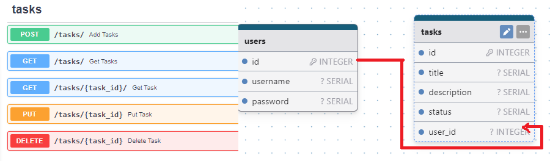

Мое тестовое 

http://176.114.89.182:7777/docs/

Запуск локально

```
docker compose up --build
http://127.0.0.1:8000/docs
```

Так же дополнительно были сделана табличка пользователей и ручки для работы с ним , чтобы 
можно было для каждой задачи присваить пользователя . (После логина в куки добавляется
jwt )
